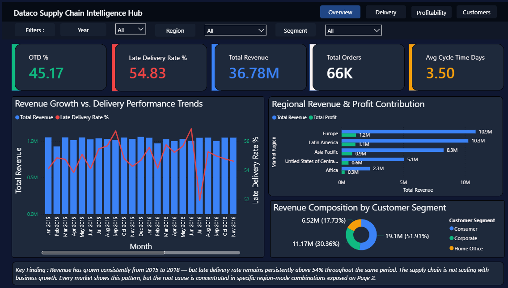
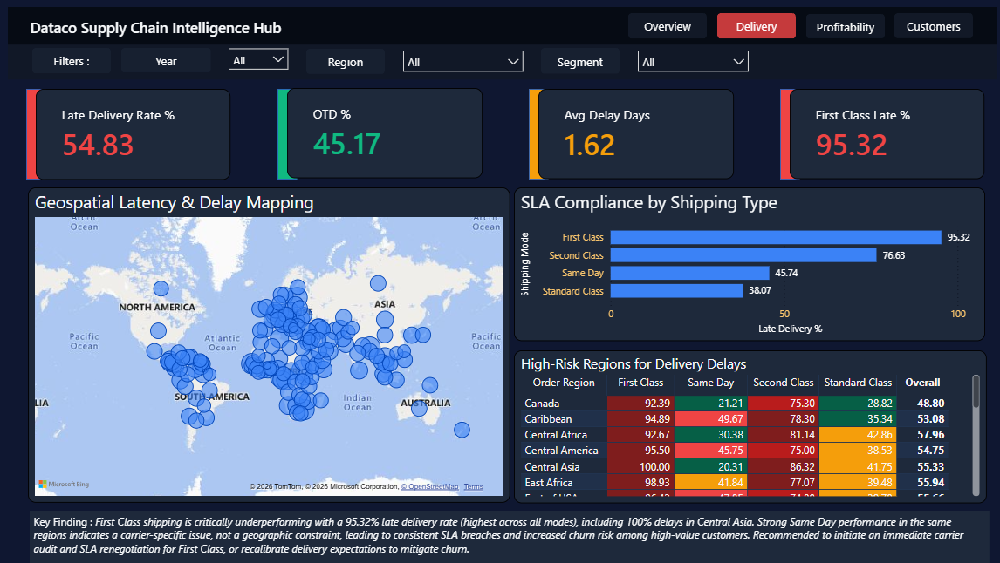
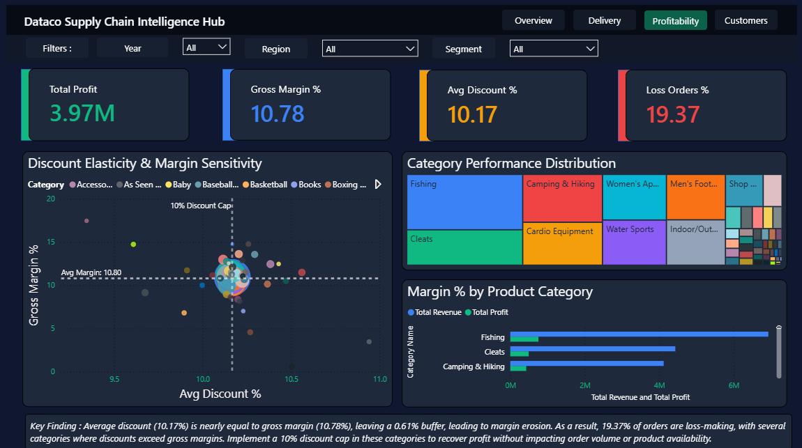
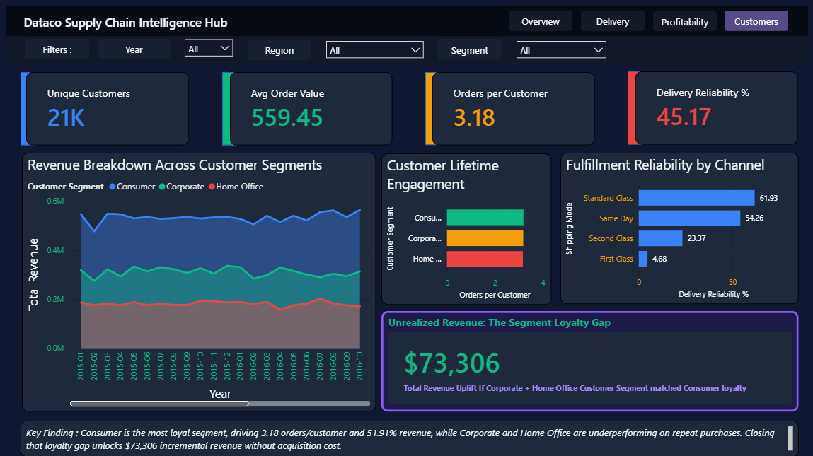

# dataco-supplychain-intelligencehub-bi
End-to-end Supply Chain BI solution - from strategy to execution - featuring a complete BI framework (SRD, PRD, Strategy, Executive Summary) - Built a BigQuery star schema on 180K+ transactions and delivered a 4-page Power BI dashboard - Solving 7 critical business problems with data-driven recommendations.


# Business Problem
A global supply chain company with 180,518 orders across 4 markets and 3 years needed to understand why revenue grew while delivery performance collapsed.

## Key Findings
| Metric | Value | Implication |
|--------|-------|-------------|
| Late Delivery Rate | 54.83% | Supply chain not scaling |
| First Class Late Rate | 95.32% | Carrier contract breach - SLA breach leads to customer churn|
| Gross Margin | 10.78% | Near-zero after 10.17% discounts |
| Loss-Making Orders | 19.37% | Discount policy destroying profit |
| Revenue Uplift Opportunity | $73,306 | Loyalty gap in B2B segments |

## Dashboard Preview





## Technical Architecture
```
Kaggle CSV (180K rows)
    ↓ Google Sheets (cleaning, 12 calculated columns)
    ↓ BigQuery (dataco-supply-chain-490712, asia-south1)
    ↓ Star Schema (1 fact + 3 dimensions)
    ↓ Power BI (30 DAX measures, 4-page dashboard)
    ↓ 7 Business Problems → 3 Quantified Recommendations

```
## Stack
- **Cloud Warehouse**: Google BigQuery (asia-south1)
- **Data Modeling**: Star schema — fact_orders, dim_customer,
  dim_product, dim_date
- **Visualization**: Microsoft Power BI (dark theme)
- **Languages**: SQL (BigQuery dialect), DAX
- **Cleaning**: Google Sheets

## 7 Business Problems Solved
1. **Late delivery epidemic (54.83%)** → Region × Mode heatmap
2. **Discount destroying margin** → Scatter: Discount% vs Margin%
3. **Consumer loyalty gap** → Orders per customer by segment
4. **Market unit economics** → Profit per order by region
5. **First Class SLA breach (95.32%)** → Shipping mode analysis
6. **Seasonal demand spikes** → Revenue + late rate combo chart
7. **Department P&L imbalance** → Category revenue vs profit bar

## 3 Quantified Recommendations
1. **Audit First Class carrier in South Asia** — Central Asia shows
   100% late rate for First Class; Same Day is fine → carrier issue
2. **Cap discounts at 10%** in bleeder categories — 0.61% buffer
   between avg discount and gross margin is destroying profit
3. **B2B retention program** — $73,306 annual uplift if Corporate
   and Home Office match Consumer order frequency

## Dataset
- Source: DataCo Supply Chain Dataset (Kaggle)
- Size: 180,518 rows, 42 columns
- Period: Jan 2015 – Jan 2018
- Markets: Europe, Latin America, Asia Pacific, USCA, Africa

## Results
- Identified $73,306 unrealized revenue opportunity
- Pinpointed exact carrier failure (First Class, Central Asia, 100%)
- Quantified discount-margin risk with 0.61% buffer warning
